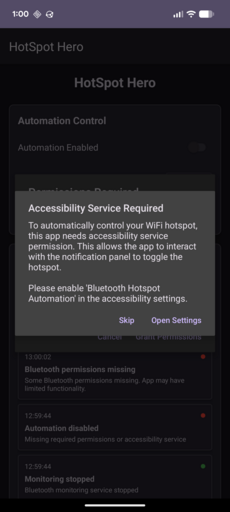
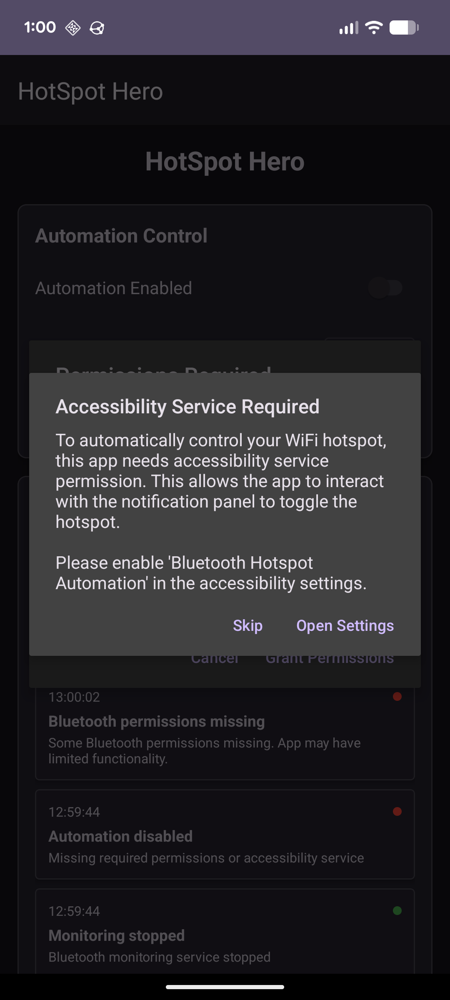

# HotSpot Hero 🦸‍♂️

**Your Car Connectivity Superhero!**

Automatically enable your phone's WiFi hotspot when your car's Bluetooth connects - even when your phone is locked. Perfect for seamless internet access for passengers and devices in your vehicle.



## 🎯 What It Does

HotSpot Hero solves a simple but annoying problem: **manually enabling WiFi hotspot every time you get in your car**. 

**Before HotSpot Hero:**
1. Get in car 🚗
2. Car Bluetooth connects 📱
3. Manually unlock phone 🔓
4. Swipe down notification panel 👆
5. Tap WiFi hotspot tile 📶
6. Wait for other devices to connect 💻📱

**With HotSpot Hero:**
1. Get in car 🚗
2. Car Bluetooth connects 📱
3. **✨ HotSpot Hero automatically enables WiFi hotspot ✨**
4. Other devices connect instantly! 🎉

## 🚀 Key Features

- **🔄 Fully Automatic**: No manual intervention needed
- **🌅 Works on Locked Screen**: Wakes your phone and enables hotspot
- **🎯 Smart Targeting**: Only responds to your specific car's Bluetooth
- **🔋 Battery Optimized**: Efficient background operation
- **🦸‍♂️ Reliable**: Uses Android's accessibility service for consistent automation
- **📊 Activity Log**: See exactly when and how automation runs
- **🧹 Clean Interface**: Simple, focused UI

## 📱 Screenshots

### Main App Interface


*Simple controls: select your car's Bluetooth device, enable automation, and you're done!*

### Automation in Action


*Activity log shows exactly when HotSpot Hero springs into action*

## ⚠️ Important Limitations

**Device Compatibility:**
- **Primarily tested on Pixel 6a** running Android 13+
- **May work on similar Android devices** but coordinates might need adjustment
- **Screen resolution dependent**: Uses specific tap coordinates for quick settings

**Installation Requirements:**
- **ADB (Android Debug Bridge)** required for installation
- **Developer options** must be enabled
- **USB debugging** must be enabled
- **Accessibility service** permissions required

**Technical Limitations:**
- Uses UI automation (accessibility service) to tap hotspot tile
- Requires specific Android quick settings layout
- Cannot be distributed via Google Play Store (accessibility service restrictions)

## 🛠️ Prerequisites

Before installing HotSpot Hero, you need:

### 1. **ADB Setup**
- Install ADB on your computer ([Download here](https://developer.android.com/studio/releases/platform-tools))
- Enable Developer Options on your phone:
  - Go to **Settings > About Phone**
  - Tap **Build Number** 7 times
  - Go back to **Settings > System > Developer Options**
  - Enable **USB Debugging**

### 2. **Phone Requirements**
- Android 8.0+ (API level 26+)
- Bluetooth capability
- WiFi hotspot capability
- Ability to grant accessibility service permissions

### 3. **Car/Device Requirements**
- Bluetooth-enabled car or device that auto-connects to your phone
- Consistent Bluetooth device name

## 📥 Quick Download

**Ready to try HotSpot Hero?**

**[⬇️ Download hotspot-hero-v1.0.0.apk](release/hotspot-hero-v1.0.0.apk)** (10.7 MB)

Then follow the installation steps below.

## 📥 Installation

### Step 1: Download
1. Download the APK directly: **[hotspot-hero-v1.0.0.apk](release/hotspot-hero-v1.0.0.apk)**
2. Or browse all releases in the [release/](release/) directory

### Step 2: Install via ADB
```bash
# Connect your phone via USB
# Make sure USB debugging is enabled

# Install the APK
adb install hotspot-hero-v1.0.0.apk
```

### Step 3: Grant Permissions
1. **Open HotSpot Hero** from your app drawer
2. **Grant Bluetooth permissions** when prompted
3. **Grant Location permission** when prompted
4. **Enable Accessibility Service**:
   - Tap "Open Settings" when prompted
   - Find "HotSpot Hero" in the accessibility services list
   - Toggle it ON
   - Confirm the warning dialog

### Step 4: Configure Your Car
1. **Select your car's Bluetooth device** from the dropdown
2. **Enable automation** with the toggle switch
3. **Test it works** with the "Test Enable" button

## 🎮 How to Use

### Initial Setup
1. **Pair your phone** with your car's Bluetooth (if not already done)
2. **Open HotSpot Hero**
3. **Select your car** from the "Target Bluetooth Device" dropdown
4. **Enable automation** with the toggle switch

### Daily Use
**That's it!** HotSpot Hero runs in the background. When your car's Bluetooth connects:

1. 📱 **HotSpot Hero detects** the connection
2. 🌅 **Wakes your screen** (if locked)
3. 👆 **Swipes down** notification panel
4. 🎯 **Taps hotspot tile** at the correct coordinates
5. 📶 **WiFi hotspot enables** automatically
6. 🎉 **Other devices can connect** immediately

### Monitoring
- Check the **Activity Log** to see automation events
- Use **Test Enable** to verify everything works
- **Toggle automation** on/off as needed

## 🔧 Troubleshooting

### "Accessibility Service Not Enabled"
- Go to **Settings > Accessibility**
- Find **HotSpot Hero** and toggle it ON
- Accept the warning dialog

### "Bluetooth Permissions Missing"
- Go to **Settings > Apps > HotSpot Hero > Permissions**
- Enable **Location** and **Nearby Devices** permissions

### "Hotspot Tile Not Found" / Wrong Position
- Your device may have different quick settings layout
- Try the **Test Enable** button to see where it taps
- May require code modification for your specific device

### "App Doesn't Respond to Car Connection"
- Ensure your car's Bluetooth device is selected correctly
- Check that automation is enabled (toggle switch)
- Verify the car's Bluetooth name hasn't changed

### "Screen Wake Not Working"
- Some devices may have different lock screen behavior
- Try disabling secure lock screen (PIN/fingerprint) for testing
- Check that the app has all required permissions

## 🏗️ Building from Source

If you want to modify the app or build it yourself:

```bash
# Clone the repository
git clone https://github.com/your-username/hotspot-hero.git
cd hotspot-hero

# Build the APK
./gradlew assembleDebug

# Install on connected device
adb install app/build/outputs/apk/debug/app-debug.apk
```

### Key Files to Modify for Different Devices:
- `HotspotAccessibilityService.kt` - Contains tap coordinates
- `ScreenWakeManager.kt` - Screen wake behavior
- `strings.xml` - UI text and messages

## 🤝 Contributing

Found a bug? Have a feature request? Want to add support for your device?

1. **Open an Issue** describing the problem or enhancement
2. **Fork the repository** and make your changes
3. **Test thoroughly** on your device
4. **Submit a Pull Request** with a clear description

### Particularly Helpful Contributions:
- **Device compatibility** improvements
- **Screen resolution** adaptations
- **Android version** compatibility
- **Better error handling**
- **UI improvements**

## ⚖️ Legal & Privacy

### Privacy
- **No data collection**: HotSpot Hero doesn't collect or transmit any personal data
- **Local operation only**: All functionality happens on your device
- **No internet required**: Works completely offline
- **No analytics or tracking**

### Accessibility Service Usage
HotSpot Hero uses Android's Accessibility Service to:
- **Detect UI elements** (notification panel, hotspot tile)
- **Perform gestures** (swipe down, tap hotspot)
- **Monitor system events** (for automation triggers)

**This is used ONLY for hotspot automation and nothing else.**

### Disclaimer
- **Use at your own risk**: This app modifies system behavior
- **No warranty**: Provided "as is" without guarantees
- **Device compatibility**: May not work on all Android devices
- **Battery impact**: Minimal but runs background service

## 📄 License

MIT License - see [LICENSE](LICENSE) file for details.


---

...and yes, this whole thing was Claude generated. But it works - so 🤷